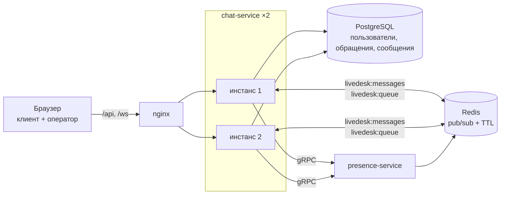

# LiveDesk

[](https://github.com/tabyreto4k/livedesk/actions/workflows/ci.yml)
[](https://github.com/tabyreto4k/livedesk/actions/workflows/codeql.yml)
[](https://github.com/tabyreto4k/livedesk/actions/workflows/release.yml)
[](.github/workflows/ci.yml)
[](LICENSE)

Чат поддержки «клиент ↔ оператор»: очередь обращений, сообщения в реальном времени, история
и статусы онлайн. Два инстанса chat-service стоят за nginx и обмениваются сообщениями через
Redis pub/sub — горизонтальное масштабирование stateful-соединений видно вживую: убей один
инстанс, и переписка продолжится на втором.

## Схема



Сообщение живёт так: STOMP-кадр → проверка участия → строка в PostgreSQL → `PUBLISH` в
Redis-канал → каждый инстанс получает его обратно и рассылает своим подписчикам. Поэтому
`convertAndSend` в коде ровно один — в `RedisMessageRelay`.

## Запуск

```bash
cp .env.example .env      # заполнить JWT_SECRET и OPERATOR_PASSWORD_HASH
docker compose up -d --wait
```

Наружу смотрит только nginx: <http://localhost:8080>. Оператора через API не завести — роль
`OPERATOR` выдаётся миграцией `V1`, хеш пароля приходит из `.env`:

```bash
docker run --rm httpd:2.4-alpine htpasswd -bnBC 10 "" 'пароль' | tr -d ':\n'
```

Образы каждой ревизии `main` — в GHCR: `ghcr.io/tabyreto4k/livedesk/<сервис>:main`.

## Демо

Страница отдаёт две панели сразу, поэтому весь сценарий проходится в одной вкладке; для
честного «двух клиентов на разных инстансах» открой её в двух окнах.

1. **Клиент**: почта и пароль → «Зарегистрироваться» → тема → «Создать обращение».
2. **Оператор**: вход под учёткой из `.env` → обращение появляется в очереди само,
   событием `/topic/queue` → «Взять».
3. Пишите в обе стороны. Рядом с собеседником горит статус: он держится пульсом раз в
   десять секунд и гаснет через тридцать после закрытия вкладки.
4. «Загрузить ещё» дочитывает историю keyset-курсором, а не смещением.

Кто кого обслужил, видно сразу в двух местах:

```bash
docker compose logs -f nginx            # адрес клиента -> адрес инстанса
docker compose logs -f chat-service-1   # INFO [chat-1] в каждой строке
```

**Убийство инстанса.** Посмотрите в логе nginx, на каком инстансе висит вкладка, и погасите
именно его:

```bash
docker compose stop chat-service-1
```

Соединение оборвётся, клиент переподключится ко второму инстансу, дочитает пропущенное
запросом истории и продолжит переписку. Сообщения не теряются: они лежат в PostgreSQL, а не
в канале Redis.

**Presence можно выключить отдельно** — чат обязан пережить и это:

```bash
docker compose stop presence-service    # статусы гаснут в offline, в логе чата WARN, чат работает
```

## Как устроено

| Модуль | Роль |
|---|---|
| `chat-service` | auth, обращения и очередь, сообщения и keyset-история, STOMP, мост через Redis |
| `presence-service` | кто онлайн: heartbeat, ключи в Redis с TTL, gRPC наружу |
| `presence-contract` | protobuf-контракт presence и сгенерированные стабы |

Ключевые тракты:

- **Очередь.** `POST /api/v1/conversations` создаёт обращение в `WAITING` и публикует событие
  операторам. `take` атомарен на уровне БД: `UPDATE … WHERE id = ? AND status = 'WAITING'`,
  ноль обновлённых строк → 409. Два оператора одно обращение не заберут — это отдельный тест.
- **Сообщения.** Отправка — STOMP `/app/conversations/{id}/send`, доставка — через Redis-канал,
  история — REST с keyset-курсором.
- **Presence.** Пульс идёт STOMP-кадром по уже открытому сокету, статусы собеседников фронт
  берёт `GET /api/v1/presence?userIds=`.
- **Медленный клиент.** `WebSocketTransportRegistration` ограничивает буфер отправки 512 КБ,
  кадр — 64 КБ, время отправки — 10 секундами. Переполнение закрывает сессию: сервер не копит
  сообщения в памяти ради того, кто их не читает, а клиент переподключится и дочитает историю.

## Почему так, а не иначе

### WebSocket против SSE и long polling

| | WebSocket (выбран) | SSE | Long polling |
|---|---|---|---|
| Направление | дуплекс | только сервер → клиент | запрос-ответ |
| Отправка сообщения | тем же соединением | нужен отдельный POST | отдельный POST |
| Задержка | кадр сразу | кадр сразу | до следующего цикла |
| Цена соединения | одно на вкладку | одно на вкладку | новое на каждый цикл |
| Прокси и балансировка | нужен `Upgrade` и липкость | обычный HTTP | обычный HTTP |
| Почему не он | — | чат дуплексный: отправка ушла бы мимо сокета | лишние запросы и задержка на ровном месте |

### Redis pub/sub против Kafka

| | Redis pub/sub (выбран) | Kafka |
|---|---|---|
| Модель | fan-out всем подписчикам | лог с оффсетами и consumer groups |
| Гарантия | at-most-once | at-least-once с хранением |
| Что нужно чату | получить сообщение всем инстансам сразу | — |
| История | в PostgreSQL | в топике, но нам это дубль |
| Цена | сервис уже в стенде под presence | брокер, обвязка, лаг |

Подробнее — [ADR-0001](docs/adr/0001-redis-pubsub-not-kafka.md).

### gRPC против REST между сервисами

| | gRPC (выбран) | REST |
|---|---|---|
| Контракт | `.proto`, стабы генерятся обеим сторонам | договорённость и документация |
| Расхождение контракта | ломает сборку | ломает рантайм |
| Кадр | бинарный, компактный | JSON и заголовки |
| Отладка руками | нужен `grpcurl` | curl и браузер |
| Почему важно здесь | пульс идёт с каждого клиента каждые 10 секунд | — |

Подробнее — [ADR-0004](docs/adr/0004-grpc-for-presence.md).

### Keyset против OFFSET

| | Keyset (выбран) | OFFSET |
|---|---|---|
| Курсор | id последнего показанного сообщения | номер строки |
| Вставки во время листания | не сдвигают страницу | дублируют и пропускают строки |
| Глубина | не влияет: индекс позиционируется сразу | линейная деградация |
| Прыжок на страницу N | нельзя | можно |

Подробнее — [ADR-0003](docs/adr/0003-keyset-pagination.md).

## Архитектурные решения

| # | Развилка | Решение |
|---|---|---|
| Р1 | Сборка | Мультимодульный Gradle, convention plugins в `build-logic` |
| Р2 | Миграции | Flyway, `ddl-auto: validate` |
| Р3 | Межинстансная доставка | Простой брокер + мост через Redis pub/sub ([ADR-0001](docs/adr/0001-redis-pubsub-not-kafka.md)) |
| Р4 | JWT в handshake | Заголовок STOMP CONNECT ([ADR-0002](docs/adr/0002-stomp-connect-jwt.md)) |
| Р5 | gRPC-стек | Стартеры Spring Boot, контракт — модуль `presence-contract` |
| Р6, Р14 | Липкость сессий | Хеш по id SockJS-сессии, для нативного WebSocket — по ключу рукопожатия |
| Р7 | История | Keyset по `(conversation_id, id)` ([ADR-0003](docs/adr/0003-keyset-pagination.md)) |
| Р8 | Presence | Redis `SET EX`, TTL = три периода пульса ([ADR-0004](docs/adr/0004-grpc-for-presence.md)) |
| Р9 | Auth | Фича в chat-service, оператор сидится миграцией |
| Р10 | Фронт | Одна страница, вендорённые SockJS и STOMP |
| Р11 | Версии | Spring Boot 4.1 ради GA-линии Spring gRPC |
| Р12 | Образы | Build-стадия на glibc, runtime — alpine |
| Р13 | CSRF | Выключен: носитель токена — заголовок, сессий нет |

**Про `ip_hash`.** Первый вариант липкости был именно им, и на стенде он оказался негодным:
nginx хеширует первые три октета адреса, поэтому вся docker-подсеть — и все вкладки за одним
NAT — уезжают на один инстанс. Ключом стал id SockJS-сессии, а для нативного WebSocket —
`Sec-WebSocket-Key`: сессия остаётся на своём инстансе, а вкладки расходятся по разным.

## Разработка

```bash
./gradlew build              # компиляция, spotless, checkstyle, unit-тесты, jacoco
./gradlew integrationTest    # Testcontainers, нужен запущенный Docker
./gradlew spotlessApply
```

JDK 21 на машине иметь не обязательно: тулчейн скачает нужный сам.

Что проверяют интеграционные тесты:

| Тест | Что доказывает |
|---|---|
| `AuthFlowIT` | регистрация, вход, защищённый эндпоинт с токеном и без |
| `QueueFlowIT` | очередь и переходы статусов; два конкурентных `take` — ровно один успех |
| `MessageKeysetIT` | страницы без дублей и пропусков, вставки не сдвигают курсор |
| `ChatWsIT` | два STOMP-клиента обмениваются сообщениями, CONNECT без токена отклонён |
| `CrossInstanceIT` | два контекста на общих Postgres и Redis: сообщение доходит между инстансами |
| `PresenceFacadeIT` | с неподнятым presence-service фасад отвечает 200 и статусами offline |
| `PresenceGrpcIT` | heartbeat включает статус, протухший TTL выключает |

Порог покрытия — 70% инструкций, проверяет `jacocoTestCoverageVerification` в CI. Точки
входа, конфигурация, DTO, контроллеры и сгенерированные стабы из счёта исключены: их
проверяют интеграционные тесты, чьи данные в отчёт не идут.

REST-сценарий руками — [docs/requests.http](docs/requests.http).

## Лицензия

[MIT](LICENSE)
